# 👋 My Windows Subsystem for Linux setup

It's not always possible to work on my preferred Operating System of choice, Linux. However, Windows now offers a mid-way point with WSL2 (Windows Subsystem for Linux). WSL2 allows me to run a Linux environment directly on my Windows machine, providing the best of both worlds. One of the advantages of using WSL2 is improved performance on client machines that are heavily monitored by IT tools, which can often slow down the system. With WSL2, I can enjoy the benefits of Linux while still working within a Windows environment.

# Enable WSL

```bash
wsl --set-version Ubuntu-24.04 2
```

# Install Ubuntu 24.04

```bash
wsl --install -d Ubuntu-24.04
```

<details style="margin-bottom: 10px;">
<summary style="cursor: pointer; padding: 5px; border: 1px solid #d3d3d3; background-color: #f9f9f9; color: #000000;">Installing WSL gif</summary>

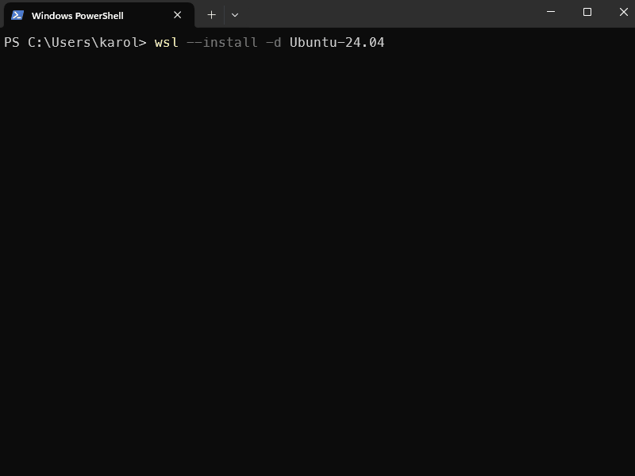

</details>

👉 Make sure to `exit` the newly created WSL container before executing the next step.

# 🛑 Enable WSL integration

* Open 🐋 `Docker Desktop`
* Click on ⚙️ `Settings`
* Click on 💽 `Resources`
* Click on `WSL Integration`
* Enable `Ubuntu-24.04` integration
* Click on `Apply & restart`

<details>
<summary style="cursor: pointer; padding: 5px; border: 1px solid #d3d3d3; background-color: #f9f9f9; color: #000000;">WSL Integration GIF</summary>

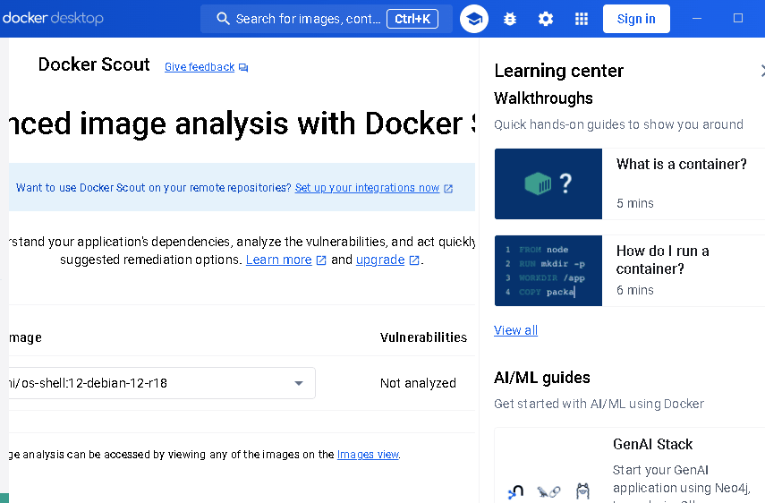

</details>

## 🎆 Ubuntu 24.04 setup

To set up Ubuntu 24.04 on WSL2, there are a few steps you can follow. Some steps are recommended (✅), and others are optional (⭐). The steps will be listed below


#### ✅ Set `Ubuntu 24.04` your default profile in `Windows Terminal`

Setting this WSL container as default terminal will ensure that by default, you are opening the most well equipped terminal toolset that will help you in your day-to-day tasks.

* Open your `Windows Terminal`

* Click on `Settings`

* in `Startup`, make sure `Default Profile` is `Ubuntu-24.04`

* Apply this setting

<details>
<summary style="cursor: pointer; padding: 5px; border: 1px solid #d3d3d3; background-color: #f9f9f9; color: #000000;">Applying default profile settings gif</summary>

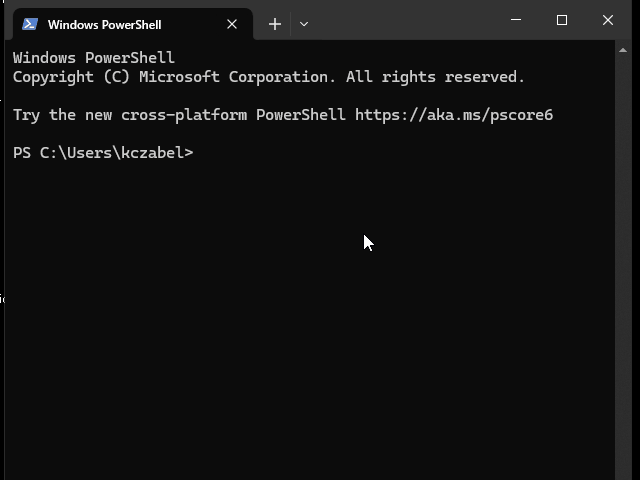

</details>

### 🛠️ Install ⏬ `.NET 8`

```bash
sudo apt-get update && \
sudo apt-get install -y dotnet-sdk-8.0
```

<details>
<summary style="cursor: pointer; padding: 5px; border: 1px solid #d3d3d3; background-color: #f9f9f9; color: #000000;">Installing dotnet gif</summary>

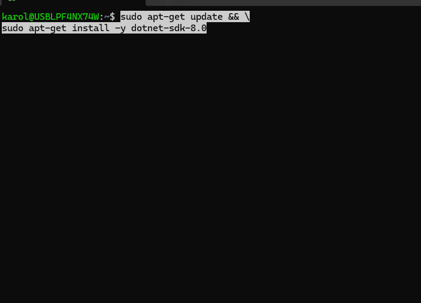

</details>

### ⚒️ 👓 Install `Windows Terminal` fonts ✍️

Download the following font files:

* [Meslo Regular](https://github.com/romkatv/powerlevel10k-media/raw/master/MesloLGS%20NF%20Regular.ttf)
* [Meslo Italic](https://github.com/romkatv/powerlevel10k-media/raw/master/MesloLGS%20NF%20Italic.ttf)
* [Meslo Bold](https://github.com/romkatv/powerlevel10k-media/raw/master/MesloLGS%20NF%20Bold.ttf)
* [Meslo Bold Italic](https://github.com/romkatv/powerlevel10k-media/raw/master/MesloLGS%20NF%20Bold%20Italic.ttf)

Double click on each of the fonts in the download location and install it on your system.

<details style="margin-bottom: 10px;">
<summary style="cursor: pointer; padding: 5px; border: 1px solid #d3d3d3; background-color: #f9f9f9; color: #000000;">Installing MesloLGS NF fonts gif</summary>


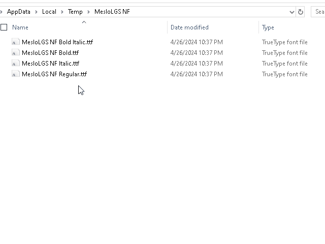

</details>


Next, open `Windows Terminal` and go into ⚙️ Settings.

On the left-hand side panel, locate `Ubuntu-24.04` and click on it.

Scroll down to `Additional settings` and click on `Appearance`.

Under `Font face`, click on `Show all fonts` and select `MesloLGS NF`

Save and enjoy ⏭️

<details style="margin-bottom: 10px;">
<summary style="cursor: pointer; padding: 5px; border: 1px solid #d3d3d3; background-color: #f9f9f9; color: #000000;">Configuring fonts in Windows Terminal gif</summary>

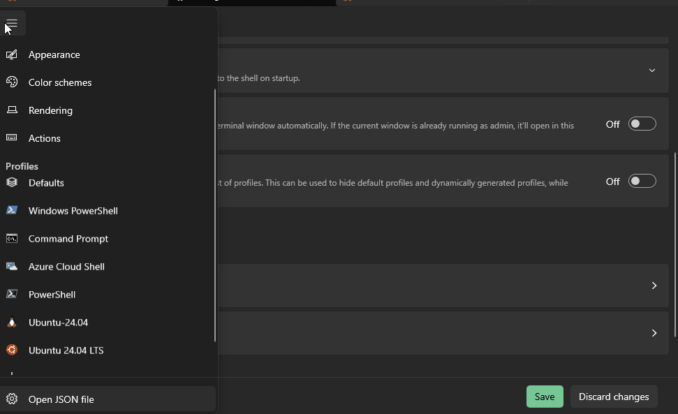

</details>

### 🤫 Add current user to `sudoers`

Controversial, but this is how I roll 🤷

```bash
echo "$USER ALL=(ALL:ALL) NOPASSWD: ALL" | sudo tee /etc/sudoers.d/$USER
```

💥 Open a new shell

```bash
sudo apt update
```

Or any other command...

<details style="margin-bottom: 10px;">
<summary style="background-color: red;">Being a sudo chad 😎</summary>

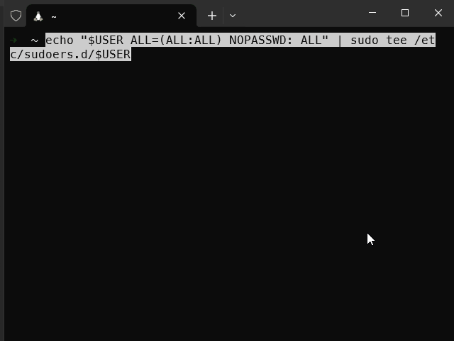

</details>

### 🤓 Install 🌒 `Midnight Commander` 🌓 - ✅ 

🌒 `Midnight Commander` (`mc`) 🌓 is a file manager for the command line that provides a user-friendly interface for navigating and managing files and directories. 
It can be useful for tasks such as copying, finding, moving, editing files, as well as performing advanced file operations.

<details style="margin-bottom: 10px;">
<summary style="cursor: pointer; padding: 5px; border: 1px solid #d3d3d3; background-color: #f9f9f9; color: #000000;">Using mc gif</summary>

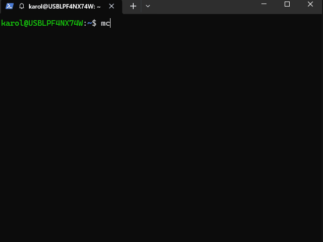
</details>

```bash
sudo apt update
sudo apt install mc -y
```

<details>
<summary style="cursor: pointer; padding: 5px; border: 1px solid #d3d3d3; background-color: #f9f9f9; color: #000000;">Installing mc gif</summary>

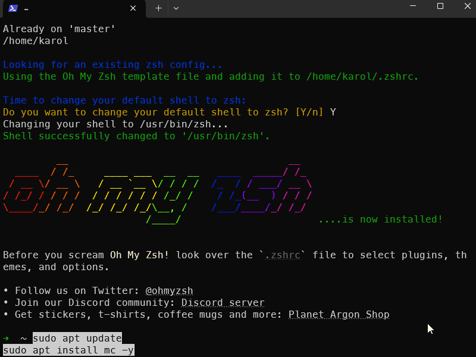
</details>

### Add 🎰 `Zsh` with 🚀 `Oh-My-Zsh` - ✅ 

`Zsh` is a powerful shell that offers advanced features and customization options. 
`Oh My Zsh` is a framework for managing Zsh configurations, providing a wide range of plugins and themes to enhance the shell experience. 

```bash
sudo apt update
sudo apt install zsh -y
```

<details style="margin-bottom: 10px;">
<summary style="cursor: pointer; padding: 5px; border: 1px solid #d3d3d3; background-color: #f9f9f9; color: #000000;">Installing zsh gif</summary>

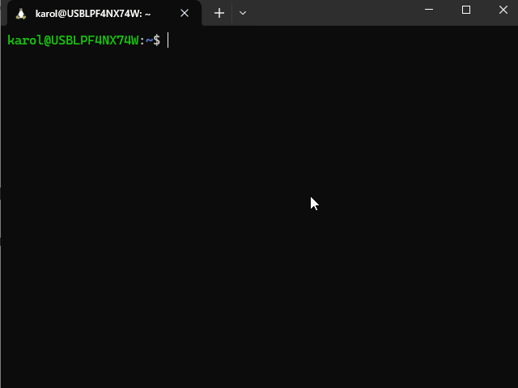

</details>

Then, install `Oh My Zsh`

```bash
sh -c "$(curl -fsSL https://raw.githubusercontent.com/ohmyzsh/ohmyzsh/master/tools/install.sh)"
```

When prompted, change your default shell to `zsh`

<details>
<summary style="cursor: pointer; padding: 5px; border: 1px solid #d3d3d3; background-color: #f9f9f9; color: #000000;">Installing oh-my-zsh gif</summary>

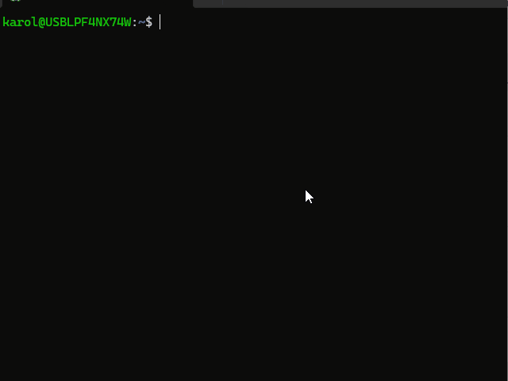

</details>

### 🪞 Making `Oh-My-Zsh` pretty

* with `powerlevel10k`

    ```bash
    git clone --depth=1 https://github.com/romkatv/powerlevel10k.git ~/powerlevel10k
    echo 'source ~/powerlevel10k/powerlevel10k.zsh-theme' >>~/.zshrc
    ```

    Then `source` back your `zshrc` to load it in.

    ```bash
    source ~/.zshrc
    ```

    Answer the prompts in the terminal and customize your terminal experience.

    <details style="margin-bottom: 10px;">
    <summary style="cursor: pointer; padding: 5px; border: 1px solid #d3d3d3; background-color: #f9f9f9; color: #000000;">applying powerlevel10k gif</summary>

    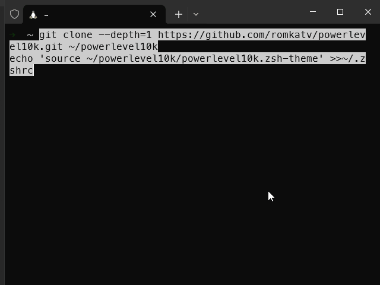
    </details>

    🗝️ If at any point you wish to change your setup, run `p10k configure`. It will rerun the setup.

    `powerlevel10k` is very useful for `git` operations, as it displays important information such as `branch` and `status` right at the prompt level.

    <details>
    <summary style="cursor: pointer; padding: 5px; border: 1px solid #d3d3d3; background-color: #f9f9f9; color: #000000;">small demonstation of powerlevel10k and a git repository gif</summary>

    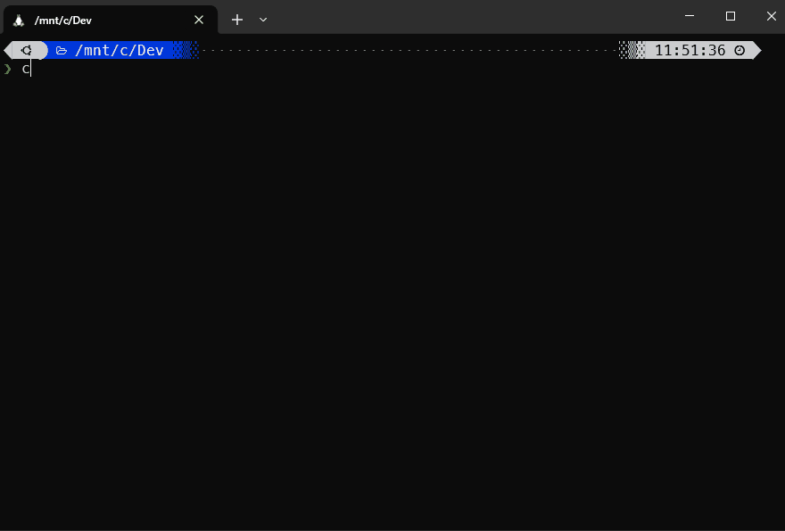

    </details>


### 🌔🚀 Install `LunarVim`

LunarVim is an amazing editor that brings the power of Neovim to your fingertips. With LunarVim, you can work in the terminal with the same efficiency as any other GUI IDE. It provides a highly customizable and extensible environment, allowing you to tailor your editing experience to your specific needs. Whether you're a beginner or an experienced developer, LunarVim offers a seamless and productive workflow, making it a top choice for many programmers.

First, we need `neovim`, the base.
```bash
curl -LO https://github.com/neovim/neovim/releases/latest/download/nvim-linux64.tar.gz
sudo rm -rf /opt/nvim
sudo tar -C /opt -xzf nvim-linux64.tar.gz
```

Add `neovim` to path. Open `~/.zshrc` in an editor (`mcedit`) and add the following at the end of the file

```bash
export PATH="$PATH:/opt/nvim-linux64/bin"
```

Re-source your shell

```bash
source ~/.zshrc
```

Check that `nvim` is available now.

<details style="margin-bottom: 10px">
<summary style="cursor: pointer; padding: 5px; border: 1px solid #d3d3d3; background-color: #f9f9f9; color: #000000;">Installing neovim gif</summary>

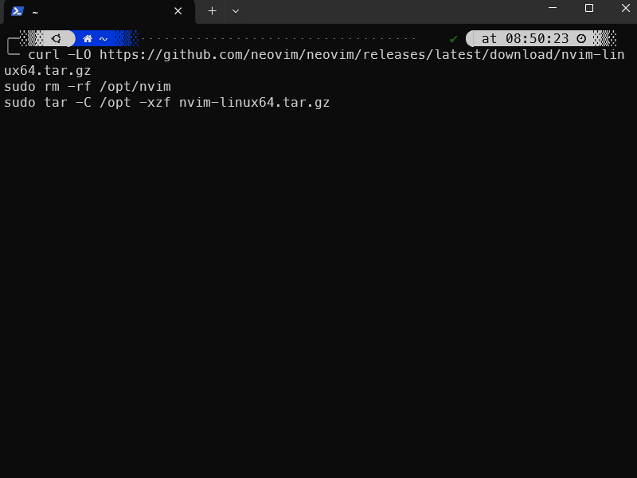

</details>

🌕 Moon Mission time 🚀, install `LunarVim`

* Install `lvim`

```bash
bash <(curl -s https://raw.githubusercontent.com/LunarVim/LunarVim/release-1.3/neovim-0.9/utils/installer/install.sh)
```

<details style="margin-bottom: 10px;">
<summary style="cursor: pointer; padding: 5px; border: 1px solid #d3d3d3; background-color: #f9f9f9; color: #000000;">Installing lvim gif</summary>

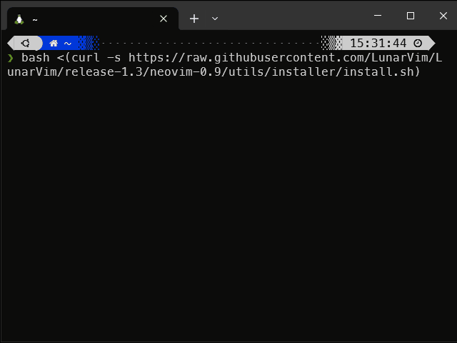

</details>

* Add `/home/{user}/.local/bin` to `$PATH` by editing your `~/.zshrc` file

* Source `~/.zshrc` to read in 

<details style="margin-bottom: 10px;">
<summary style="cursor: pointer; padding: 5px; border: 1px solid #d3d3d3; background-color: #f9f9f9; color: #000000;">Adding lvim to PATH gif</summary>

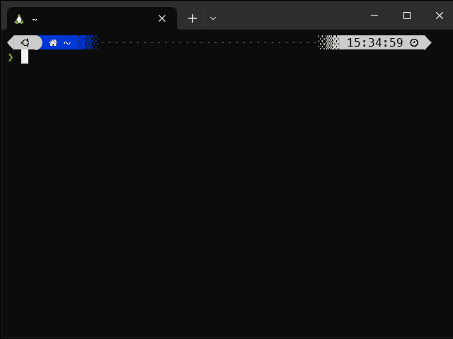

</details>

* Install `C#` into `lvim` language cache

* Open up any document, or open up `lvim` in editing mode (e.g. `lvim .`)

* Start typing `:` (colon - this activates command mode) and type 

`TSInstall c_sharp`

* C# syntax highlighting is now installed

<details style="margin-bottom: 10px;">
<summary style="cursor: pointer; padding: 5px; border: 1px solid #d3d3d3; background-color: #f9f9f9; color: #000000;">Adding lvim to PATH gif</summary>

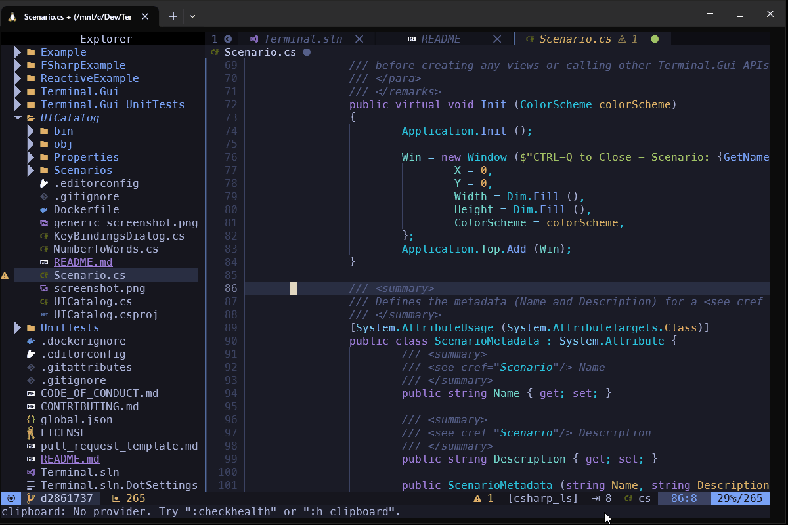

</details>


