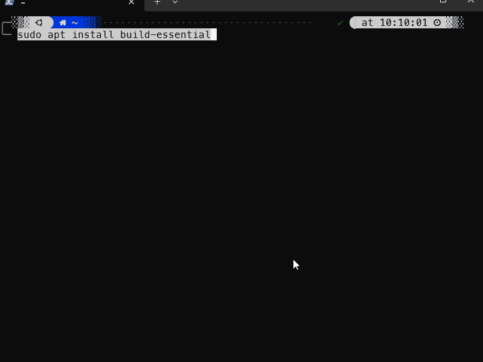

# 👋 My Windows Subsystem for Linux setup

It's not always possible to work on my preferred Operating System of choice, Linux. However, Windows now offers a mid-way point with WSL2 (Windows Subsystem for Linux). WSL2 allows me to run a Linux environment directly on my Windows machine, providing the best of both worlds. One of the advantages of using WSL2 is improved performance on client machines that are heavily monitored by IT tools, which can often slow down the system. With WSL2, I can enjoy the benefits of Linux while still working within a Windows environment.

## Enable WSL 2 for Ubuntu-24.04

```bash
wsl --set-version Ubuntu-24.04 2
```

## Install Ubuntu 24.04

```bash
wsl --install -d Ubuntu-24.04
```

<details style="margin-bottom: 10px;">
<summary style="cursor: pointer; padding: 5px; border: 1px solid #d3d3d3; background-color: #f9f9f9; color: #000000;">Installing WSL gif</summary>


</details>

👉 Make sure to `exit` the newly created WSL container before executing the next step.

## 🔌 Enable WSL Integration

* Open 🐋 `Docker Desktop`
* Click on ⚙️ `Settings`
* Click on 💽 `Resources`
* Click on `WSL Integration`
* Enable `Ubuntu-24.04` integration
* Click on `Apply & restart`

<details style="margin-bottom: 10px;">
<summary style="cursor: pointer; padding: 5px; border: 1px solid #d3d3d3; background-color: #f9f9f9; color: #000000;">WSL Integration GIF</summary>


</details>

# 🎆 Ubuntu 24.04 setup

In this section, we will perform various software installations and configurations to set up Ubuntu 24.04 for optimal development experience. Here are the steps we will cover:

1. Set `Ubuntu 24.04` as your default profile in `Windows Terminal`.
2. Install `.NET 8` and `.NET 7` for .NET development.
3. Install `Windows Terminal` fonts for better visual experience.
4. Add the current user to `sudoers` for convenient sudo access.
5. Install `Midnight Commander` (`mc`) for file management.
6. Add `Zsh` with `Oh-My-Zsh` for a powerful shell experience.
7. Install `LunarVim` for an enhanced Neovim-based editor.

By following these steps, you will have a fully configured Ubuntu 24.04 environment with the necessary tools and settings for efficient software development. Feel free to skip any steps that you don't need or already have installed. Let's get started! 🚀🌟🔧🔨🎉


## ✅ Set `Ubuntu 24.04` your default profile in `Windows Terminal`

Setting this WSL container as default terminal will ensure that by default, you are opening the most well equipped terminal toolset that will help you in your day-to-day tasks.

* Open your `Windows Terminal`

* Click on `Settings`

* in `Startup`, make sure `Default Profile` is `Ubuntu-24.04`

* Apply this setting

<details>
<summary style="cursor: pointer; padding: 5px; border: 1px solid #d3d3d3; background-color: #f9f9f9; color: #000000;">Applying default profile settings gif</summary>


</details>

## 🛠️ Install ⏬ `.NET 8`

```bash
sudo apt-get update && \
sudo apt-get install -y dotnet-sdk-8.0
```

<details>
<summary style="cursor: pointer; padding: 5px; border: 1px solid #d3d3d3; background-color: #f9f9f9; color: #000000;">Installing .NET 8 gif</summary>


</details>

## 🛠️ Install ⏬ `.NET 7`

To Install `.NET 7` on `Ubuntu 24.04` we need to add the `backports` apt registry.

Execute the following to add the `backports` apt registry.

The `apt` package manager will prompt you to press the Enter key.

```bash
sudo add-apt-repository ppa:dotnet/backports
```

Execute the folowing to install `.NET 7`

```bash
sudo apt-get update && \
sudo apt-get install -y dotnet-sdk-7.0
```

<details>
<summary style="cursor: pointer; padding: 5px; border: 1px solid #d3d3d3; background-color: #f9f9f9; color: #000000;">Installing .NET 7 gif</summary>


</details>

## ⚒️ 👓 Install `Windows Terminal` fonts ✍️

Download the following font files:

* [Meslo Regular](https://github.com/romkatv/powerlevel10k-media/raw/master/MesloLGS%20NF%20Regular.ttf)
* [Meslo Italic](https://github.com/romkatv/powerlevel10k-media/raw/master/MesloLGS%20NF%20Italic.ttf)
* [Meslo Bold](https://github.com/romkatv/powerlevel10k-media/raw/master/MesloLGS%20NF%20Bold.ttf)
* [Meslo Bold Italic](https://github.com/romkatv/powerlevel10k-media/raw/master/MesloLGS%20NF%20Bold%20Italic.ttf)

Double click on each of the font files to download them. Once downloaded, locate the font files on your system and double click on each file to install them.

<details style="margin-bottom: 10px;">
<summary style="cursor: pointer; padding: 5px; border: 1px solid #d3d3d3; background-color: #f9f9f9; color: #000000;">Installing MesloLGS NF fonts gif</summary>


</details>

Next, open `Windows Terminal` and go to the ⚙️ Settings.

On the left-hand side panel, locate `Ubuntu-24.04` and click on it.

Scroll down to `Additional settings` and click on `Appearance`.

Under `Font face`, click on `Show all fonts` and select `MesloLGS NF`.

Save your changes and enjoy the new font in your terminal! ⏭️

<details style="margin-bottom: 10px;">
<summary style="cursor: pointer; padding: 5px; border: 1px solid #d3d3d3; background-color: #f9f9f9; color: #000000;">Configuring fonts in Windows Terminal gif</summary>


</details>

## 🤫 Add current user to `sudoers`

The sudo command in Linux allows users to execute commands with elevated privileges, typically as the root user. It is a powerful tool that grants users the ability to perform administrative tasks and make system-wide changes. However, it must be used with caution. Giving unrestricted sudo access to a user can potentially lead to unintended consequences, such as accidental modification or deletion of critical system files. It is important to carefully consider the level of access granted to users and ensure that only trusted individuals have sudo privileges. Additionally, it is recommended to log and monitor sudo activities to detect any unauthorized or malicious actions.

Controversial, but this is how I roll 🤷

Execute the following to add the user to the `sudoers` group.

```bash
echo "$USER ALL=(ALL:ALL) NOPASSWD: ALL" | sudo tee /etc/sudoers.d/$USER
```

<details style="margin-bottom: 10px;">
<summary style="background-color: red;">Being a sudo chad 😎</summary>


</details>


## Install `Zsh` with 🚀 `Oh-My-Zsh`

`Zsh` is a powerful shell that offers advanced features and customization options.
`Oh My Zsh` is a framework for managing `Zsh` configurations, providing a wide range of plugins and themes to enhance the shell experience.

Install `zsh`

```bash
sudo apt update
sudo apt install zsh -y
```

Install `Oh My Zsh`, when prompted, change your default shell to `zsh`

```bash
sh -c "$(curl -fsSL https://raw.githubusercontent.com/ohmyzsh/ohmyzsh/master/tools/install.sh)"
```

<details style="margin-bottom: 10px;">
<summary style="cursor: pointer; padding: 5px; border: 1px solid #d3d3d3; background-color: #f9f9f9; color: #000000;">Installing oh-my-zsh gif</summary>


</details>

Next, we will be applying the `powerlevel10k` theme on top.

```bash
git clone --depth=1 https://github.com/romkatv/powerlevel10k.git ~/powerlevel10k
echo 'source ~/powerlevel10k/powerlevel10k.zsh-theme' >> ~/.zshrc
source ~/.zshrc
```
Answer the prompts in the terminal and customize your terminal experience.

<details style="margin-bottom: 10px;">
<summary style="cursor: pointer; padding: 5px; border: 1px solid #d3d3d3; background-color: #f9f9f9; color: #000000;">applying powerlevel10k gif</summary>


</details>

You can always change the look and feel by running `p10k configure` in terminal.


## 🌔🚀 Install `LunarVim`

LunarVim is an amazing editor that brings the power of Neovim to your fingertips. With LunarVim, you can work in the terminal with the same efficiency as any other GUI IDE. It provides a highly customizable and extensible environment, allowing you to tailor your editing experience to your specific needs. Whether you're a beginner or an experienced developer, LunarVim offers a seamless and productive workflow, making it a top choice for many programmers.

First, we need `neovim`, the base.

```bash
curl -LO https://github.com/neovim/neovim/releases/latest/download/nvim-linux64.tar.gz
sudo rm -rf /opt/nvim
sudo tar -C /opt -xzf nvim-linux64.tar.gz
```

Add `neovim` to path. Open `~/.zshrc` in any file editor (e.g. `mcedit` or `vim`) and add the following at the end of the file

```bash
export PATH="$PATH:/opt/nvim-linux64/bin"
```

Re-source your shell

```bash
source ~/.zshrc
```

Check that `nvim` is available now.

<details style="margin-bottom: 10px">
<summary style="cursor: pointer; padding: 5px; border: 1px solid #d3d3d3; background-color: #f9f9f9; color: #000000;">Installing neovim gif</summary>


</details>

Install `build-essential` tools.

```bash
sudo apt install build-essential
```

Install **LunarVim**. The install process will prompt you about addon choices. I typically choose to install nodejs dependencies and ignore others.

⚠️ Please pay attention to the following prompts during the installation process of LunarVim:

1. The installer will ask if you want to install NodeJS dependencies. Answer 'yes' to install them.
2. The installer may ask about other dependencies. Answer `no` to skip them.

```bash
bash <(curl -s https://raw.githubusercontent.com/LunarVim/LunarVim/release-1.3/neovim-0.9/utils/installer/install.sh)
```

The installer will warn you that the `PATH` variable does not contain the newly created directory for `lvim`.

The output may be similar to this:

```bash
[WARN] the folder /home/karol/.local/bin is not on PATH, consider adding 'export PATH=/home/karol/.local/bin:$PATH'
```

Make sure you change your username from `karol` to whatever you're using. Add the following to the end of your `~/.zshrc`.

```bash
export PATH="/home/karol/.local/bin:$PATH"
```

Now, source the rc file and you will have access to `lvim`.

```bash
source ~/.zshrc
```

<details style="margin-bottom: 10px;">
<summary style="cursor: pointer; padding: 5px; border: 1px solid #d3d3d3; background-color: #f9f9f9; color: #000000;">Installing LunarVim gif</summary>



</details>

## Install 🌒 `Midnight Commander` 🌓 

🌒 `Midnight Commander` (`mc`) 🌓 is a file manager for the command line that provides a user-friendly interface for navigating and managing files and directories. 
It can be useful for tasks such as copying, finding, moving, editing files, as well as performing advanced file operations.

<details style="margin-bottom: 10px;">
<summary style="cursor: pointer; padding: 5px; border: 1px solid #d3d3d3; background-color: #f9f9f9; color: #000000;">Using mc gif</summary>


</details>

```bash
sudo apt update
sudo apt install mc -y
```

<details>
<summary style="cursor: pointer; padding: 5px; border: 1px solid #d3d3d3; background-color: #f9f9f9; color: #000000;">Installing mc gif</summary>


</details>

## Install 🪟 `tmux`

tmux is a powerful terminal multiplexer that allows you to manage multiple terminal sessions within a single window. It provides a wayy to create, organize, and switch between multiple terminal sessions, making it easier to work on different tasks simultaneously. With tmux, you can split your terminal window into multiple panes, detach and reattach sessions, and even share sessions with other users.

To install tmux, you can use the following commands:

```bash
sudo apt update
sudo apt install tmux -y
```

Next, we will be modifying the default key bindings.

Create a `.tmux.conf` file under your user directory

```bash
touch ~/.tmux.conf
```

Edit the `~/.tmux.conf` file and add the following to set it up:

```sh
set -g default-terminal "screen-256color"

set -g prefix C-a
unbind C-b

bind-key C-a send-prefix

unbind %
bind | split-window -h

unbind '"'
bind - split-window -v

unbind r
bind r source-file ~/.tmux.conf

set -g mouse on
```

Save the `~/.tmux.conf` file and you can now use the `tmux` multiplexer.

